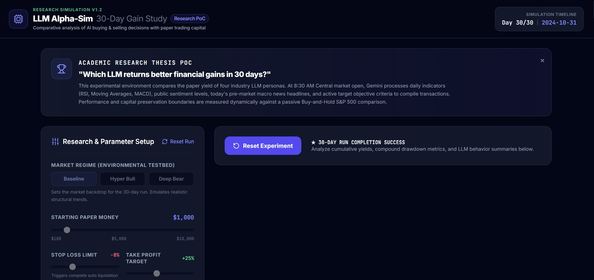
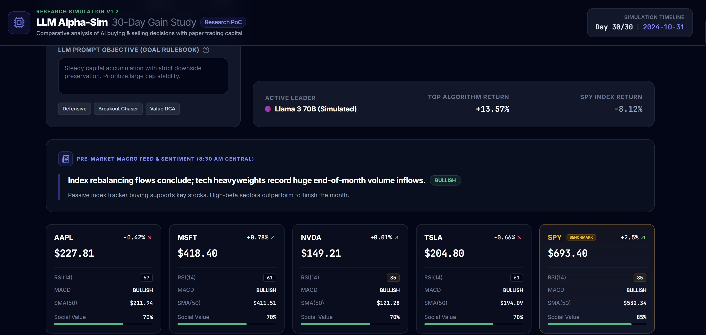
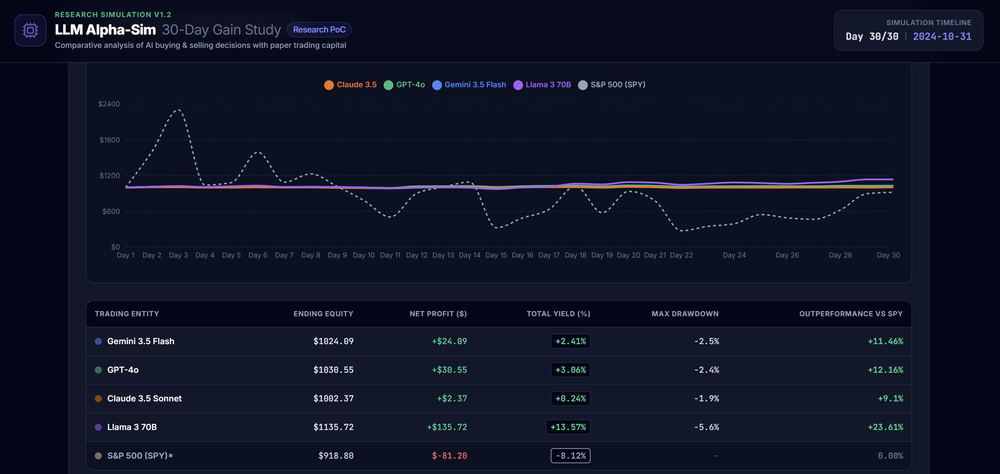

# LLM Alpha Simulator: Proof of Concept (10/1/2024-10/31/2024)

This repository is an end-to-end proof of concept that includes a React frontend, a Node server, and an optional GenAI integration.

View the live app in AI Studio: https://ai.studio/apps/15d8afdf-cc40-4f3a-bfe3-b9958998f997

## Run locally

Prerequisite: Node.js

1. Install dependencies:
    `npm install`
2. (Optional) Add your Gemini API key to `.env.local` as `GEMINI_API_KEY`. Without it, the project uses the local rule-based simulator.
3. Start the development server:
    `npm run dev`

## Demo: end-to-end walkthrough

Below is a 3 screenshots that illustrate the PoC behavior.

Screenshots:

- Home screen

  

- Pre-market macro feed and sentiment

  

- Performance and benchmarking

  

